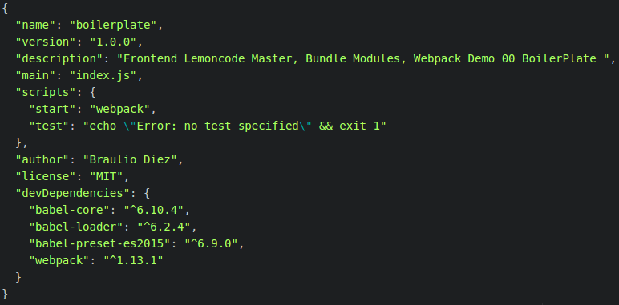

# Ejemplo Boiler Plate

En este ejemplo vamos a crear un proyecto para poder manejarlo fácilmente con webpack.

Vamos a configurar un proyecto inicial npm, daremos soporte para ES6 e instalaremos webpack.
Luego crearemos un ejemplo helloworld.js

Pasos:
 - Prerrequisitos: Instalar Node.js
 - Inicializar package.json (npm init)
 - Crear un fichero HTML (index.html).


# Pasos para construirlo

## Prerrequisitos

Instalar [Node.js y npm](https://nodejs.org/en/) (v6.3.1) si todavía no está instalado en tu PC.

> Para verificar que tienes instalado node v6.x.x y npm 3.x.x ejecuta en el terminal o en la consola de windows `node -v` and `npm -v`. Las versiones mas antiguas puedes causar errores.

## Pasos

- Navega hasta la carpeta donde vas a crear el proyecto.

- Ejecuta `npm init`, se pedirá responder a algunos datos para tener mas información sobre el proyecto (una vez rellenado los datos, se creará un archivo **package.json** con toda esta información).


````
npm init
````


- Instala **webpack** de forma local, como dependencia de desarrollo (la razón por la que es recomendado instalarlo de forma local en el proyecto y no global es porque será mas fácil ejecutarlo, por ejemplo, en una máquina limpia, sin obligar a que se instale de forma global ningun paquete como nodejs).

````
npm install webpack --save-dev
````

- Para lanzar webpack de forma local como hemos comentado en el punto anterior, modificaremos el archivo **package.json** y añadiremos la siguiente propiedad `"start": "webpack"` dentro del objeto scripts. Con este cambio, podremos lanzar webpack con el comando npm `npm start`.

 Ahora, nuestro archivo **package.json** quedaría de la siguiente forma:


- Escibiremos código ES6, pero necesitamos traducirlo a ES5, para ello instalaremos `babel-core` mas `babe-preset-es2015` y lo guardaremos como dependencia de desarrollo en el archivo **package.json** que ha sido generado previamente.

````
npm install babel-core --save-dev
npm install babel-preset-es2015 --save-dev
````

- Necesitamos instalar un "loader" (se explicará en los siguientes módulos) con el fin de que webpack sea capaz de usar `babel-core`.

````
npm install babel-loader --save-dev
````

Nuestro archivo **package.json** quedaría de la siguiente forma:




- Ahora creamos un archivo javascript **students.js** , que incluirá la sintaxis ES6.

```javascript
// Usaremos algunas características ES6
const averageScore = "90";
const messageToDisplay = `average score ${averageScore}`;

document.write(messageToDisplay);
```

- Vamos a configurar ahora webpack, creamos un archivo vacío **webpack.config.js**, e indicamos que js tendremos como punto de partida.

```javascript
module.exports = {
  entry: ["./students.js"],
  output: {
    filename: "bundle.js"
  }
}
```

- Ahora añadimos soporte para ES6, pediremos a webpack el manejo de todos los archivos js en el directorio del proyecto (excluyendo la subcarpeta `node_modules`) y traduciremos desde ES6 a ES5 (usando `babel-loader`).

```javascript
module.exports = {
  entry: ["./students.js"],
  output: {
    filename: "bundle.js"
  },

  module: {
    loaders: [
      {
        test: /\.js$/,
        exclude: /node_modules/,
        loader: "babel-loader",
        query: {
          presets: ['es2015']
        }
      }
    ]
  }
}
```

- Vamos a arrancar webpack desde la línea de comandos, escribiendo `npm start` y presionando enter.

```
npm start
```


- Podemos comprobar que se ha generado un nuevo archivo **bundle.js** .

- Si abrimos este nuevo archivo **bundle.js** , podemos comprobar que tiene (además de otros boiler plate) la traducción a ES5 de la versión **students.js**.

```javascript
/***/ function(module, exports) {

	"use strict";

	// Let's use some ES6 features
	var averageScore = "90";
	var messageToDisplay = "average score " + averageScore;

	document.write(messageToDisplay);

/***/ }
```

- Creamos ahora un archivo simple HTML, **index.html**, e incluimos una etiqueta script donde referenciamos nuestro archivo js generado **bundle.js**. Ahora hacemos click sobre nuestro archivo HTML y podremos ver nuestra pequeño ejemplo funcionando.

```html
<!DOCTYPE html>
<html>
  <head>
    <meta charset="utf-8">
    <title></title>
    <script src="bundle.js"></script>
  </head>
  <body>
    Hello webpack !
  </body>
</html>
```


