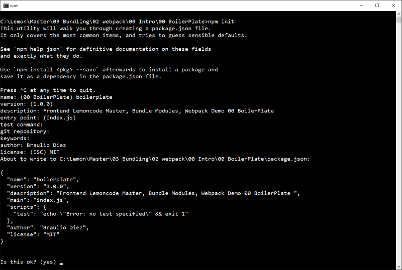

# Ejemplo de módulos

En este ejemplo vamos a empezar a trabajar con módulos es6 (import).

We will start from sample 00 Demo and add a new javascript that will
hold a simple algorithm to calculate the average of an score array.
Partiendo de la muestra 00 Intro / 00 BoilerPlate y añadiremos un nuevo fichero JavaScript que
implemente un algoritmo simple para calcular el promedio de una matriz de puntuación.

Usaremos este nuevo array javascript en el fichero principal, students.js, realizando una importación de él.

Summary steps:
 - Add a new file averageService.js
 - Add an array on students.js
 - Import averageService into students.js
 - Use the averageService inside the students.js code.
 - Transpile and test on index.html


# Steps to build it

## Prerequisites

Prerequisites, you will need to have nodejs installed in your computer. If you want to follow this step guides you will need to take as starting point sample "00 BoilerPlate"

## steps

- Let's add a new file called averageService.js, this file will contain a function that will calculate the average value of a given array, this function will be exported (make it visible to other modules that need to consume them)

```
export function getAvg(score) {
  return score.reduce(function (p, c) {
    return p + c;
  }) / score.length;
}
```

- Now let's update students.js to import that file and consume it.

````
import {averageService} from "./averageService"

const scores = [90, 75, 60, 99, 94, 30]
const averageScore = averageService(scores);
const messageToDisplay = `average score ${averageScore}`;

document.write(messageToDisplay);
````

- Now let's run webpack from the command prompt and click on the index.html, we
can see that the new average function is up and running and has been included in
the bundle.js file.



## Appendix - Playing with import

- Other ways to use modules, one popular way is to use "export default"
indicating that by default the average function will be the one exported, then
we can directly use an import "alias" and this will point out to our averarge function.

Export default (averageService.js)

````
export default function getAvg(score) {
  return score.reduce(function (p, c) {
    return p + c;
  }) / score.length;
}
````

Import and usage (students.js)

````
import getAvg from "./averageService"

const scores = [90, 75, 60, 99, 94, 30]
const averageScore = getAvg(scores);
const messageToDisplay = `average score ${averageScore}`;

document.write(messageToDisplay);
````


- Another way to use import is to use "*" to indicate we want to import everything
from that module, let's add for the sake of this sample two functions sum and average,
then on the main students file we can import everything provides an alias and use
the function we need.

Several Exports (AverageService)

````
export function getAvg(score) {
  return score.reduce(function (p, c) {
    return p + c;
  }) / score.length;
}

export function getSum(score) {
  return score.reduce(function (p, c) {
    return p + c;
  });
}
````

Import * and usage sum + average

````
import * as stats from "./averageService"

const scores = [90, 75, 60, 99, 94, 30]
const averageScore = stats.getAvg(scores);
const sumScore = stats.getSum(scores);
const messageToDisplayAvg = `average score ${averageScore}`;
const messageToDisplaySum = `sum score ${sumScore}`;

document.write(messageToDisplayAvg);
document.write(messageToDisplaySum);
````
