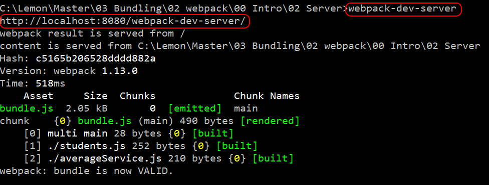
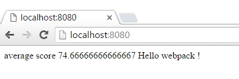
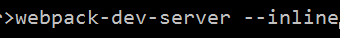
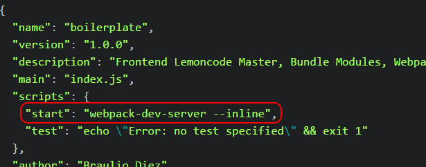

# Modules Sample

In this file we are going to enter into "dev mode", working with files service
is not ideal when you are developing a web application, we will learn how to launch
a lite web server, how deploy our bundle into a dist folder (including index.html)
,how to debug our es6 code directly into the browser debugger and minify
our bundle.js.

We will start from sample 01 Import, install webpack-dev-server, setup our config
to deploy on config folder and support maps (debug), then we will minify
our bundle.js file via webpack cli params.

Summary steps:
 - Install via npm webpack-dev-server.
 - Execute webpack-dev-server with live reload.
 - Add start command to package.json.

# Steps to build it

## Prerequisites

Prerequisites, you will need to have nodejs installed in your computer. If you want to follow this step guides you will need to take as starting point sample "01 Import " (not taking account appendix).

## steps

- Let's install webpack-dev-server this package ships with a lite server that we
can use as dev web server. This time we have to install this package as a global dependency (note down the "-g" param)

````
npm install webpack-dev-server -g
````

- Now we can directly execute from the command prompt webpack-dev-server, this
will launch our web dev server, in this case in port 8080




- If we open a browser we can point the url to http://localhost:8080 and we will browse our web app




- One interesting feature that ships this dev server is live reloading, if we introduce an update in any of the javascript files it will be automatically detected and  webpack dev server will launch the build process and once finished automatically refresh the page being display in the browser. In order to do thiswe need to call webpack-dev-server with an additional param:



- We don't need to remember this params every time we want to launch our dev
server,in order to avoid this we can just add an "start" script to our package json




- Once we have saved this change we can directly execute from the command prompt

````
npm start
````

- Now that we are using this approach, we don't need to have webpack-dev-server globally, we could just insall it at project stop and use "npm start" to launch it.

````
npm install webpack-dev-server --save-dev
````


And we will get our dev server up and running.
