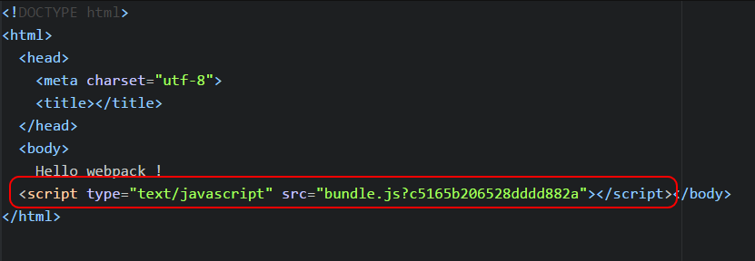
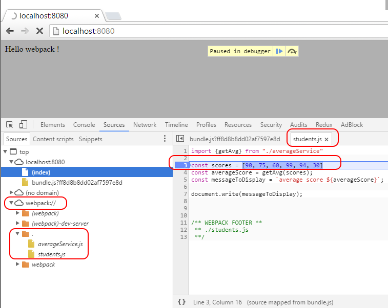
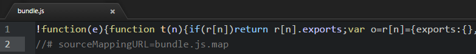

# Ejemplo de módulos

En este ejemplo, vamos a crear una carpeta dist, donde copiaremos el paquete webpack y la página main.html.

Empezaremos arrancando desde el ejemplo 02 Server,

Resumen de los pasos que vamos a realizar:
 - Redirigir la salida (bundle.js) a la carpeta "dist".
 - Añadir al proceso build lo siguiente: copiar el fichero index.html a la carpeta "dist".
 - Dejar a cargo de webpack la inclusión del script 'bundle.js' en el fichero index.html.
 - Añadir *map support* para permitir debuggear ficheros ES6 directamente en el explorador.
 - Generar una versión reducida de bundle.js.


# Pasos para construirlo

## Prerrequisitos  

Lo primero es que necesitas es tener instalado nodejs en tu ordenador. Si quieres seguir una guía con los pasos a seguir, necesitas arrancar el ejemplo "02 server".

## Pasos  

- No es una buena idea mezclar código fuente con el que generamos (Bundle). Es mejor colocar el código generado en una carpeta aparte (llamémosla 'dist'). Para poder configurar esto, vamos a indicar la 'carpeta de salida' en webpack. Primero, ponemos la ruta de tu paquete (path) al principio del fichero webpack.config.js. Después crearemos una variable donde indicaremos el basepath (el path donde se encuentra webpack.config):

````
var path = require("path");

var basePath = __dirname;
````

- Debajo de la seccion *output*, añadiremos un nuevo parámetro llamado path, indicando en él cual será la salida (la ruta actual + "/dist") . Una vez realizado esto, ya podemos ejecutar webpack y comprobar que el código generado (bundle output) se encuentra en la carpeta dist.

````
output: {
    path: path.join(basePath, "dist"),
    filename: 'bundle.js'
  },
````

- Ya tenemos el fichero Javascript en la carpeta dist, y estaría bien poder incluir el fichero index.html en esa carpeta, y sería mucho mejor si no necesitásemos poner de manera manual el tag script del fichero bundle.js, y dejar que sea webpack quien haga esto por nosotros (incluyendo el parámetro hash para evitar que el navegador cachee cuando haya nuevas versiones desplegadas). En este punto, vamos a introducir el concepto del [webpack plugin](https://webpack.github.io/docs/plugins.html): Son plugins que permiten inyectar pasos customizados en la construcción del *build*. Mientras tanto, loaders (por ejemplo, babel-loader) actúan fichero a fichero (ficheros que tengan una extensión por ej. js o ts..), y son plugins que actúan globalmente y que son ejecutados una vez. Necesitamos instalar un plugin llamado [html-webpack-plugin](https://github.com/ampedandwired/html-webpack-plugin), desde la línea de comandos, indicando:

````
npm install html-webpack-plugin --save-dev
````

- Borramos de nuestro fichero inicial 'index.html' el script tag:

````
<!DOCTYPE html>
<html>
  <head>
    <meta charset="utf-8">
    <title>Webpack 1.x by sample</title>   
  </head>
  <body>
    Hello webpack !
  </body>
</html>
````

- Este plugin (html-webpack-plugin) tomará como plantilla de entrada nuestro index.html, y nosotros indicaremos el destino de salida (el fichero index.html de la carpeta dist). Este plugin copiará index.html dentro del fichero destino e incluirá el tag script incluido en el mapa de tags, para evitar que el navegador cachee cuando se desplieguen nuevas versiones. Una vez instalado, es necestario añadir al principio de nuestro fichero webpack.config.js:

````
var HtmlWebpackPlugin = require('html-webpack-plugin');
````

- Para poder configurarlo, tenemos que añadir lo siguiente en nuestro fichero webpack.config.js (justo después de la definición de los módulos)

````
plugins:[
  //Generado index.html en /dist => https://github.com/ampedandwired/html-webpack-plugin
  new HtmlWebpackPlugin({
    filename: 'index.html', //Nombre del fichero en ./dist/
    template: 'index.html' //Nombre de la plantilla en ./src
  })
]
````


- Seguidamente, si arrancamos webpack, conseguiremos realizar una copia de index.html a la carpeta dist y el script tag se generará automáticamente. Esto es sólo una advertencia: nosotros no ponemos parámetros adicionales al mapa para evitar el cacheo del navegador, podemos establecer la opción en la configuración, poniendo hash a true:

````
plugins:[
  //Generado index.html en /dist => https://github.com/ampedandwired/html-webpack-plugin
  new HtmlWebpackPlugin({
    filename: 'index.html', //Nombre del fichero en ./dist/
    template: 'index.html', //Nombre de la plantilla en ./src
    hash: true			
  })
]
````




- Esto pinta bien pero, nosotros somos desarrolladores, y ¿qué podría pasar si intentamos debuggear desde el navegador nuestra aplicación web? por defecto solo parece disponible para debuguear bundle.js) (el gran fichero creado para ES5),  si necesitamos identificar problemas y debuggear paso a paso, esto queda lejos de ser lo ideal. ¿Es que no hay un camino que el navegador me deje ir al fichero original y me deje debuggear directamente en modo ES6? La respuesta es sí, debemos añadir una línea de código a nuestro fichero de configuración webpack.config, justo después del cierre de output closing, nosotros podemos incluir esta línea:

````
devtool: 'source-map',
````
Ahora, si queremos arrancar nuestro web server de nuevo (npm start) y abrir la pestaña de desarrollador, tendremos disponible para buscar en nuestro fichero original en ES6 y poder poner puntos de ruptura y debuggear.



-  Sólo un apunte más para terminar... un paso obligatorio para cualquier aplicación web es no minimizar / ofuscar los ficheros javascript, en realidad, sólo tenemos que llamar webpack añadiendo el parámetro -p.

````
webpack -p
````

Si abrimos el fichero generado bundle.js, podemos comprobar que la nueva versión a sido minimizada.


