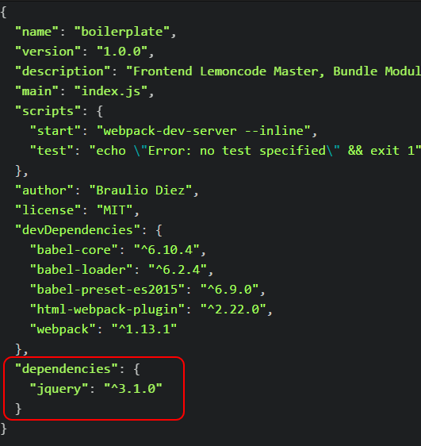
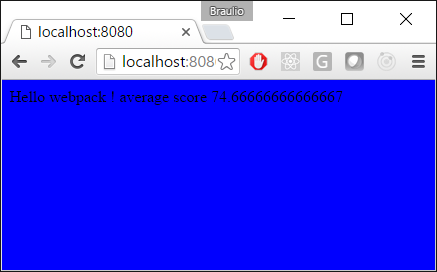
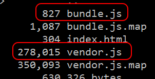

# Ejemplo librería externa (JQuery)

Hasta ahora hemos hecho un buen progreso...pero falta uno de los pilares de fundamentales del desarrollo web, el uso de librerías de terceros.

En este ejemplo instalaremos una librería (JQuery) a través de npm, definida de forma global, y la usaremos. Finalmente acabaremos creando un paquete de librerías por separado.

Empezaremos a partir del ejemplo 03 Output.

Pasos:
 - Instalar JQuery a través de npm.
 - Configuraión del alias global ($).
 - Crear algún ejemplo usando esta librería.
 - Partir en dos paquetes: bundle.js and vendor.js.


# Pasos para construirlo

## Prerrequisitos

Prerrequisitos, necesitas tener instalado nodejs en tu ordenador. Si quieres seguir esta guía, necesitarás tomar el ejemplo anterior "03 Output".

## Pasos

- Empezaremos descargando la librería JQuery a través de npm, en este caso ejecutaremos el siguiente comando `npm install jquery --save`, anotación: esta vez no estamos añadiendo el sufijo *-dev* como parámetro, en este caso el paquete JQuery es una dependencia de la aplicación web y no del proceso de compilación.

````
npm install jquery --save
````



- Dado que esta en una librería "legacy" (hecha antes de que emergieran los nuevos estándares) hay que usar una variable global, en vez de asignarlo manualmente, vamos a definirlo en el archivo webpack.config.js, para ello necesitamos una importacion de webpack en la parte de arriba del archivo:

````
var webpack = require("webpack");
````

- A continuación vamos a usar un plugin de webpack para definir variables globales: jQuery and $.

````
plugins:[
  new webpack.ProvidePlugin({
    $: "jquery",
    jQuery: "jquery"
  }),
  //Generate index.html in /dist => https://github.com/ampedandwired/html-webpack-plugin
  new HtmlWebpackPlugin({
````

- Ahora está preparado para usarlo, para probarlo, cambiaremos el color de fondo de la página a azul. Vamos a cambiarlo en el elemento body usando  JQuery:

````
import {getAvg} from './averageService';

$('body').css('background-color', 'blue');
````

- Arrancamos la aplicación (npm start) y comprobamos como ha cambiado el color de fondo de blanco a azul.



- Para acabar con esta demostración, vamos a plantear este ejemplo: queremos dividir el paquete en dos, uno que sería a nivel de aplicacion, y otro que contendrá las librerías de terceros, para ello vamos a usar CommonChunkPlugin (incluido en webpack), en este plugin vamos a especificar las librerías que van a estar separadas en otro js bajo la categoría de 'vendor'. Empezamos añadiendo un nuevo punto de entrada llamado  'vendor', donde definiremos un array un array con todas las librerías que queremos que estén en este paquete (anotación, la entrada no es un array, es un objeto).

````
module.exports = {
  entry: {
    vendor: ["jquery"],
    app: "./students.js"
  },
````

- Luego definimos el plugin y el archivo de salida:

````
plugins:[
  new webpack.optimize.CommonsChunkPlugin("vendor", "vendor.js"),
  new webpack.ProvidePlugin({
````

Si miramos la carpeta dist, podemos comprobar que los dos paquetes han sido creados.




Finalmente en el archivo index.html generado (en la carpeta dist) podemos comprobar que ambos scripts han sido referenciados satisfactoriamente:

````
<!DOCTYPE html>
<html>
  <head>
    <meta charset="utf-8">
    <title></title>    
  </head>
  <body>
    Hello webpack !
  <script type="text/javascript" src="vendor.js?320a16e25cb5421c9f10">
  </script><script type="text/javascript" src="bundle.js?320a16e25cb5421c9f10"></script></body>
</html>
````
