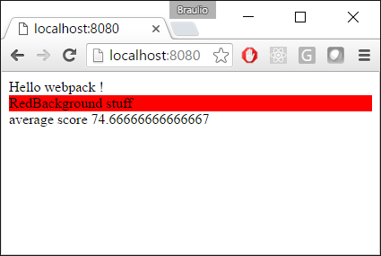
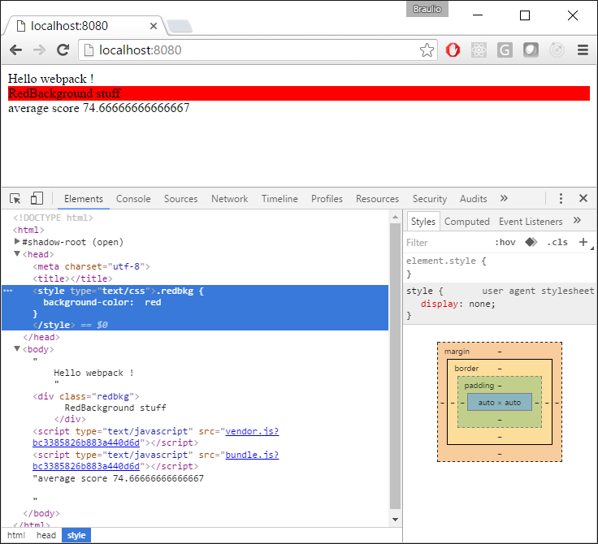

# Ejemplo de Custom CSS

Vamos a comenzar a trabajar con estilos.

En este ejemplo crearemos un archivo CSS personalizado (que contendrá una sencilla clase css, que establecerá un color de fondo a rojo).

Comenzaremos desde el ejemplo 00 Intro/04 JQuery.

Pasos a seguir:
 - Crear un archivo personalizado de css.
 - Instalar los paquetes style loader css loader.
 - Configurar el webpack.config.js


# Pasos a seguir

## Prerequisitos

Prerrequisitos, necesitarás tener nodejs instalado en el ordenador. Si quieres seguir estos pasos de necesitarás tomar como punto de partida el ejemplo "00 Intro/04 Jquery".

## Pasos

- Ahora vamos a crear un sencillo archivo CSS que añadirá fondo de color rojo cuando usemos en algunos div de ejemplo. (lo llamaremos mystyles.css)

```css
.redbkg {
  background-color:  red
}
```

- Y ahora podemos usar este estilo directamente en nuestro archivo HTML (hasta aquí todo bien, si arrancamos este proyecto ahora no veremos los estilos aplicados, tenemos que hacerlo a través de la configuración de Webpack), vamos a actualizar el index.html

```html
<body>
  Hello webpack !
  <div class="redbkg">
    RedBackground stuff
  </div>
</body>
```

- Instalamos el style-loader y css-loader como dependencias de desarrollo


````
npm install style-loader --save-dev
````


````
npm install css-loader --save-dev
````

- Importamos este estilo desde nuestro archivo principal de javascript, tenemos que añadir las siguientes líneas de código al archivo students.js:

````javascript
import * as styles from "./mystyles.css";
````
- Si lanzamos un build de Webpack nos lanzará errores, esto se debe a que no tenemos definido ningun loader para manejar la extensión css, vamos a configurar Webpack como es debido, añadimos a la sección de loaders una entrada de css y ejecutamos primero la extensión css-loader (manejadora de los archivos CSS), después el style-loader (añade CSS de una clase de estilo)

````javascript
module: {
  loaders: [
    {
      test: /\.css$/,
      exclude: /node_modules/,
      loader: "style-loader!css-loader"
    },			
    {
      test: /\.js$/,
      loader: "babel-loader",
      exclude: /node_modules/,
      query: {
        presets: ['es2015']
      }
    }
  ]
},
````

- Ya se puede ejecutar la aplicación (npm start) y comprobar como el fondo rojo se muestra en los divs que hemos elegido.



- ¿Por qué ha desaparecido el fondo azul? ¿Dónde ha ido el CSS? Si abrimos las herramientas de desarrollo en nuestro navegador y pulsamos en la pestaña de red, podemos comprobar que no hay archivo de CSS que sea requerido, pero si nosotros abrimos el archivo principal de HTML, podemos comprobar como éste ha sido incluido como un estilo.




- En próximas demostraciones aprenderemos como preguntar a Webpack separar los estilos del bundle.js en el archivo CSS de salida separado, dependiendo de tu escenario si se puede elegir de un modo u otro.  
