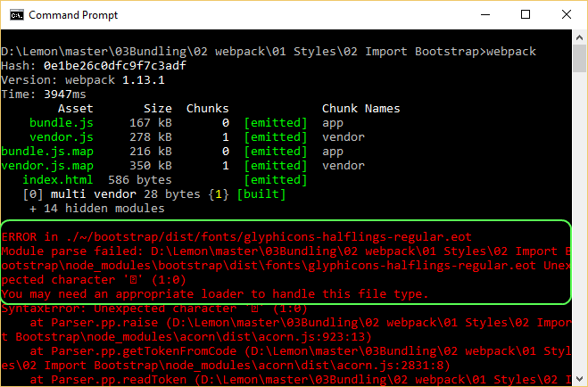
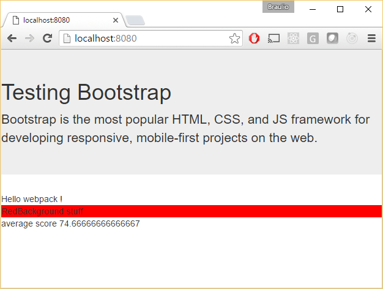

# Importing Bootstrap

In this demo we will install the well known [Bootstrap](https://getbootstrap.com/) CSS library, 
we will configure webpack to import it and use a Bootstrap component.

We will start from sample 01 Styles/01 Custom CSS.

Summary steps:
 - Install Bootstrap.
 - Import the CSS library.
 - Use a jumbotron element from Bootstrap in our HTML.
 - Check that we get errors when running webpack.
 - Install additional loaders in order to manage fonts and other.
 files required by bootstrap.
 - Check results.


# Steps to build it

## Prerequisites

Prerequisites, you will need to have nodejs installed in your computer. If you want to follow this guide you will need to take as starting point sample "01 Styles / 01 Custom CSS".

## steps

- Let's start by installing Bootstrap:

```
npm install bootstrap --save
```

- Let's import the CSS library in order to include it in our project (students.js):

```javascript
import * as bootstrap from "./node_modules/bootstrap/dist/css/bootstrap.css";
```

- Since we are going to dig into node_modules, on the css loader section of webpack.config.js let's remove the node_modules ignore.

```javascript
// Since we are importing bootstrap, we need to remove
// node_modules ignore
{
  test: /\.css$/,
  loader: "style-loader!css-loader"
},
```

- Let's modify our index.html and include some specific Bootstrap component:

```html
<div class="jumbotron">
  <h1>Testing Bootstrap</h1>
  <p>Bootstrap is the most popular HTML, CSS, and JS framework for developing responsive,
  mobile-first projects on the web.</p>
</div>

Hello webpack !
```

- If we try to run webpack now we will get errors, webpack is complaining that he is not able to process fonts that are being
used by Bootstrap, we need to set a font appropiated loader:



- Let's set up the appropiate font / glyphicon loaders. We will install
first [file-loader](https://github.com/webpack/file-loader). It will produce a new file into our build directory (/dist) and return the
public url.

```
npm install file-loader --save-dev
```

- Producing all the files (images, fonts) in separate files is something we are used to, but what happens if we have a lot small files like this? Initial load of the page would be slower requesting a big bunch of small files, another option that we have is to use [url-loader](https://github.com/webpack/url-loader), in this case the files is encoded as data inside the HTML... and we can combine file-loader / url-loader by adding a condition, encode only files that are smaller that a given size.

```
npm install url-loader --save-dev
```

- Now let's include this loaders in the webpack.config.js:

```javascript
module: {
  loaders: [
    // Since we are importing bootstrap, we need to remove
    // node_modules ignore
    {
      test: /\.css$/,
      loader: "style-loader!css-loader"
    },
    {
      test: /\.js$/,
      loader: "babel-loader",
      exclude: /node_modules/,
      query: {
        presets: ["es2015"]
      }
    },
    // Loading glyphicons => https://github.com/gowravshekar/bootstrap-webpack
    // Using here url-loader and file-loader
    {
      test: /\.(woff|woff2)(\?v=\d+\.\d+\.\d+)?$/,
      loader: "url?limit=10000&mimetype=application/font-woff"
    },
    {
      test: /\.ttf(\?v=\d+\.\d+\.\d+)?$/,
      loader: "url?limit=10000&mimetype=application/octet-stream"
    },
    {
      test: /\.eot(\?v=\d+\.\d+\.\d+)?$/,
      loader: "file"
    },
    {
      test: /\.svg(\?v=\d+\.\d+\.\d+)?$/,
      loader: "url?limit=10000&mimetype=image/svg+xml"
    }
  ]
},
```
Observe that when we invoked *url-loader* we just called it *url*. 
The *-loader* suffix can be cut out. We could also spread this on *babel*, *style* and *css* loaders.

- Let's launch the application (npm start) and check that our page is being displayed
using Bootstrap styles (see [Bootstrap's jumbotron](https://getbootstrap.com/components/#jumbotron)).


