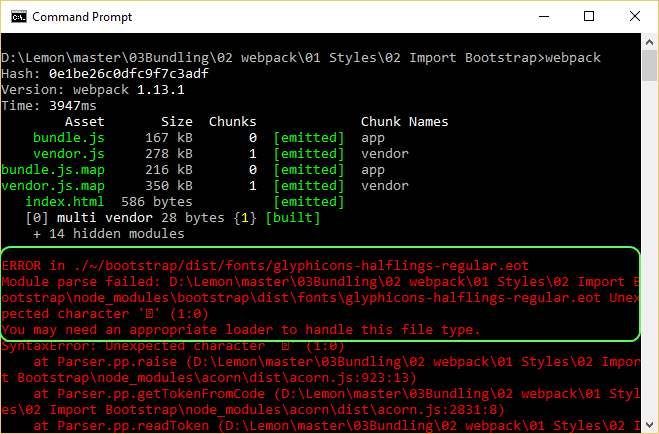

# Importando Bootstrap

En esta demo instalaremos la conocida librería de CSS 
[Bootstrap](https://getbootstrap.com/), configuraremos webpack para importarlo 
y usar un componente.

Partiremos del ejemplo "01 Styles / 01 Custom CSS".

Pasos:
 - Instalar Bootstrap.
 - Importar la librería en el proyecto.
 - Usar el componente *jumbotron* de Bootstrap en nuestro HTML.
 - Comprobar que tenemos errores al ejecutar webpack.
 - Instalar cargadores adicionales para administrar fuentes y 
 otros archivos requeridos por Bootstrap.
 - Comprobar los resultados.


# Pasos

## Prerrequisitos

Necesitarás tener instalado nodejs en tu ordenador.
Tomaremos como referencia de inicio el ejemplo "01 Styles / 01 Custom CSS".

## Pasos

- Vamos a empezar instalando Boostrap:

```
npm install bootstrap --save
```

- Importamos la librería de CSS para incluirla en nuestro proyecto, en *students.js*: 

```javascript
import * as bootstrap from './node_modules/bootstrap/dist/css/bootstrap.css';
```
- Como utilizaremos ficheros de directorio *node_modules* vamos a eliminar la línea que
excluye este directorio, en el cargador de CSS:

```javascript
// Ya que estamos importando Boostrap tenemos que eliminar
// la línea que ignora node_modules
{
  test: /\.css$/,
  loader: 'style-loader!css-loader'
},
```

- Vamos a modificar nuestro *index.html* para que incluya algún componente de Bootstrap:

```html
<div class="jumbotron">
  <h1>Testing Bootstrap</h1>
  <p>Bootstrap is the most popular HTML, CSS, and JS framework for developing responsive,
  mobile-first projects on the web.</p>
</div>

Hello webpack !
```

- Si ejecutamos el comando *webpack* vemos que tenemos errores, webpack se está quejando
porque no es capaz de procesar las fuentes que necesita Boostrap, necesitamos añadir
un cargador de fuentes apropiado:



- Vamos a configurar el cargador de fuentes / glyphicons. Instalaremos primero el
[file-loader](https://github.com/webpack/file-loader). Éste se encargará de generar
un nuevo archivo bajo el directorio de producción (*/dist*) y devolver la URL pública.

```
npm install file-loader --save-dev
```

- Estamos acostumbrados a generar cada archivo (fuentes, imágenes) en un fichero
separado pero, ¿qué ocurriría si tenemos una gran cantidad de archivos? Cuando
cargue nuestra página inicialmente se ralentizaría ya que tendría que realizar muchas
peticiones de estos archivos pequeños, otra opción es utilizar
[url-loader](https://github.com/webpack/url-loader), de esta forma los archivos son
codificados como datos dentro del HTML... así podemos combinar los cargadores
*file-loader* / *url-loader* añadiendo una condición, codifica solamente los archivos
que tengan un tamaño inferior a uno que nosotros especifiquemos. 

```
npm install url-loader --save-dev
```

- Vamos a incluir los cargadores en el proyecto, en *webpack.config.js*:

```javascript
module: {
  loaders: [
    // Ya que estamos importando Boostrap tenemos que eliminar
    // la línea que ignora node_modules
    {
      test: /\.css$/,
      loader: 'style-loader!css-loader'
    },
    {
      test: /\.js$/,
      loader: 'babel-loader',
      exclude: /node_modules/,
      query: {
        presets: ['es2015']
      }
    },
    // Para cargar glyphicons => https://github.com/gowravshekar/bootstrap-webpack
    // Aquí usaremos file-loader y url-loader
    {
      test: /\.(woff|woff2)(\?v=\d+\.\d+\.\d+)?$/,
      loader: 'url?limit=10000&mimetype=application/font-woff'
    },
    {
      test: /\.ttf(\?v=\d+\.\d+\.\d+)?$/,
      loader: 'url?limit=10000&mimetype=application/octet-stream'
    },
    {
      test: /\.eot(\?v=\d+\.\d+\.\d+)?$/,
      loader: 'file'
    },
    {
      test: /\.svg(\?v=\d+\.\d+\.\d+)?$/,
      loader: 'url?limit=10000&mimetype=image/svg+xml'
    }
  ]
},
```
Fíjate que cuando invocamos a *url-loader* sólo lo llamamos *url*.
El sufijo *-loader* es opcional y podemos eliminarlo si queremos. También podemos 
aplicar esto en los otros cargadores *babel*, *style* y *css*. 

- Vamos a ejecutar la aplicación (npm start) y comprobar que se muestra la página
utilizando los estilos de Boostrap (más información sobre el componente
[jumbotron de Boostrap](https://getbootstrap.com/components/#jumbotron)).


