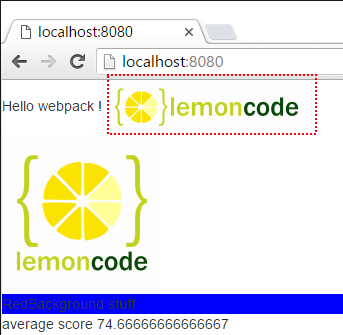

# Handling Images

In this demo we are going to include images in our project in two flavours: via
JavaScript and via HTML. On the JavaScript side we will see it's something
straightforward (using the same plugins we used for fonts), for the HTML we will
use a new loader: [*html-loader*](https://github.com/webpack/html-loader).

We will start from sample [01 Styles / 03 SASS](https://github.com/Lemoncode/webpack-1.x-by-sample/tree/master/01%20Styles/03%20SASS).

Summary steps:
 - Add two images to our project.
 - Add the code to load the first image via JavaScript.
 - Configure the loader.
 - Add the second image to the HTML file.
 - Install *html-loader*.
 - Configure *html-loader* in the webpack.config.js.


# Steps to build it

## Prerequisites

Prerequisites, you will need to have [Node.js](https://nodejs.org) installed in your
computer. If you want to follow this guide you will need to take as starting point
sample [01 Styles / 03 SASS](https://github.com/Lemoncode/webpack-1.x-by-sample/tree/master/01%20Styles/03%20SASS).

## steps

- Let's start by making some cleanup in our *index.html*, we are going to remove
the Bootstrap's *jumbotron* component and add a `<div>` with a given "id".

```html
<body>    
  Hello webpack !

  <div id="imgContainer"></div>

  <div class="redbkg">
    RedBackground stuff
  </div>
</body>
```

- We will continue by creating a folder named **content** and adding two images there:
[logo_1.png](https://github.com/Lemoncode/webpack-1.x-by-sample/blob/master/01%20Styles/04%20Handling%20Images/content/logo_1.png)
and
[logo_2.png](https://github.com/Lemoncode/webpack-1.x-by-sample/blob/master/01%20Styles/04%20Handling%20Images/content/logo_2.png).

- Let's jump into *students.js* and import *logo_1.png* using JavaScript.
Let's place it under a given `<div>`:

```javascript
import logoImg from './content/logo_1.png';

const img = document.createElement('img');
img.src = logoImg;

document.getElementById('imgContainer').appendChild(img);
```

- We have already installed *url-loader* plugin, so we only need to configure the
extension png/jpeg in the *webpack.config.js* loaders section. One thing to note down is that
we are adding an additional parameter to the url-loader called **limit**. By using this
parameter we are telling the loader to encode the image if its size is less than
5KB approx and embed it directly in the HTML file.

```javascript
loaders: [
  {
    test: /\.(png|jpg)$/,
    exclude: /node_modules/,
    loader: 'url-loader?limit=5000'
  },			
```

- Now if run the app (npm start) we can check that the first logo is being shown.


- That's fine but what if we had already the image referenced inside a HTML
`` tag? Let's add *logo_2.png* into the *index.html* file:

```html
<body>
  Hello webpack !

  
```

- Since *logo_2.png* is not directly imported from a JavaScript file it will not be
processed. For this case we can use a plugin called [html-loader](https://github.com/webpack/html-loader).
This loader will search in the HTML for `` tags and process them.
Let's install *html-loader*:

```
npm install html-loader --save-dev
```

- Let's update *webpack.config.js* to use this loader:

```javascript
module: {
  loaders: [
    {			  
      test: /\.html$/,
      loader: 'html-loader'
    },
```

- Now if we run the app (npm start) we can see the second logo appearing:



- Finally if we open the developer tools in our browser we can see that the
*src* attribute of the `` has changed:


