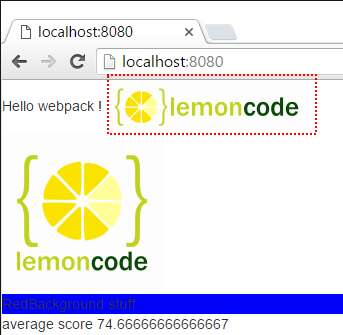

# Tratamiento de imágenes

En este ejemplo vamos a añadir imágenes a nuestro proyecto de dos maneras: vía 
JavaScript y vía HTML. Desde JavaScript veremos que el procedimiento es bastante
sencillo (utilizando los mismos plugins que hemos usado para las fuentes), y desde
HTML usaremos un nuevo plugin: 
[*html-loader*](https://github.com/webpack/html-loader). 

Partiremos del ejemplo [01 Styles / 03 SASS](https://github.com/Lemoncode/webpack-1.x-by-sample/tree/master/01%20Styles/03%20SASS).

Resumen de los pasos:
 - Añadir dor imágenes al proyecto.
 - Añadir el código para cargar la primera imagen vía JavaScript.
 - Configurar el plugin.
 - Añadir la segunda imagen a nuestro *index.html*.
 - Instalar *html-loader*.
 - Configurar *html-loader* dentro de *webpack.config.js*.


# Pasos

## Requisitos previos

Necesitarás tener instalado [Node.js](https://nodejs.org) en tu ordenador. Si quieres
seguir esta guía necesitarás tomar como punto de inicio el ejemplo
[01 Styles / 03 SASS](https://github.com/Lemoncode/webpack-1.x-by-sample/tree/master/01%20Styles/03%20SASS).  

## pasos

- Vamos a empezar haciendo limpieza en nuestro *index.html*, vamos a eliminar el
componente *jumbotron* de Bootstrap y añadir un `<div>` con una "id".

```html
<body>    
  Hello webpack !

  <div id="imgContainer"></div>

  <div class="redbkg">
    RedBackground stuff
  </div>
</body>
```

- Contiruaremos creando un directorio llamado **content** y añadiendo ahí las dos imágenes:
[logo_1.png](https://github.com/Lemoncode/webpack-1.x-by-sample/blob/master/01%20Styles/04%20Handling%20Images/content/logo_1.png)
y
[logo_2.png](https://github.com/Lemoncode/webpack-1.x-by-sample/blob/master/01%20Styles/04%20Handling%20Images/content/logo_2.png).

- Ahora nos dirigimos a *students.js* e importamos *logo_1.png* usando JavaScript.
Vamos a colocarlo dentro del `<div>` que hemos creado.


```javascript
import logoImg from './content/logo_1.png';

const img = document.createElement('img');
img.src = logoImg;

document.getElementById('imgContainer').appendChild(img);
```

- Ya tenemos instalado el plugin *url-loader*, así que lo único que nos hace falta es
configurarlo para las extensiones png/jpg en la sección de cargadores en 
*webpack.config.js*. Fíjate que vamos a añadir un parámetro adicional a *url-loader*
llamado **limit**. Usando este parámetro le estamos diciendo al plugin que codifique
sólo los archivos cuyo tamaño sea inferior a 5KB aproximadamente y que los inyecte
directamente en el fichero HTML.

```javascript
loaders: [
  {
    test: /\.(png|jpg)$/,
    exclude: /node_modules/,
    loader: 'url-loader?limit=5000'
  },			
```

- Ahora si ejecutamos la aplicación (npm start) podemos comprobar que se muestra
el primer logo.


- Por ahora todo bien pero ¿qué pasaría si la imagen estuviera ya incluida dentro
de una etiqueta HTML ``?. Vamos a añadir *logo_2.png* dentro de *index.html*: 

```html
<body>
  Hello webpack !

  
```

- Ya que *logo_2.png* no está importada directamente desde un fichero JavaScript 
no se va a procesar. Para resolver esto podemos usar un plugin llamado 
[html-loader](https://github.com/webpack/html-loader). Este cargador se va a encargar
de buscar todas las etiquetas `` dentro del HTML y procesarlas.
Vamos a instalar *html-loader*: 


```
npm install html-loader --save-dev
```

- Ahora actualicemos *webpack.config.js* para usar este cargador:

```javascript
module: {
  loaders: [
    {			  
      test: /\.html$/,
      loader: 'html-loader'
    },
```

- Ahora si ejecutamos la aplicación (npm start) vemos que aparece el segundo logo:



- Finalmente vemos desde el navegador en las herramientas para desarrollores que el código fuente que 
la imagen en la etiqueta `` ha cambiado:

