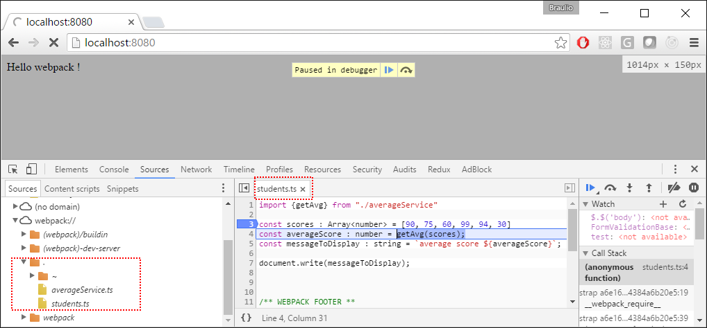

# TypeScript

En este ejemplo añadiremos soporte para [TypeScript](https://www.typescriptlang.org/).

Partiremos desde el ejemplo
[00 Intro / 03 Ouput](https://github.com/Lemoncode/webpack-1.x-by-sample/tree/master/00%20Intro/03%20Output)
, instalaremos TypeScript de forma local, configuraremos un fichero *tsconfig.json*,
añadiremos unos cuantos ficheros TypeScript, instalaremos el plugin
[*ts-loader*](https://github.com/TypeStrong/ts-loader) y lo configuraremos en
*webpack.config.js*.

Resumen de los pasos:
 - Instalar TypeScript como dependencia local.
 - Configurar TypeScript en nuestro proyecto usando el fichero *tsconfig.json*.
 - Migrar el código de nuestro proyecto a TypeScript y añadirle algunas características
 propias del lenguaje.
 - Instalar el plugin [*ts-loader*](https://github.com/TypeStrong/ts-loader).
 - Añadir la configuración adecuada en *webpack.config.js*.


# Pasos

## Requisitos previos

Necesitarás tener instalado [Node.js](https://nodejs.org) en tu ordenador. Si quieres
seguir esta guía necesitarás tomar como punto de inicio el ejemplo
[00 Intro / 03 Ouput](https://github.com/Lemoncode/webpack-1.x-by-sample/tree/master/00%20Intro/03%20Output).

## pasos

- TypeScript es un buen *superset* de JavaScript que permite añadir tipado entre
otras características interesantes. Todo el código que hagamos en TypeScript no se
ejecutará en el navegador, por eso necesitaremos *transpilarlo*. Vamos a instalar
TypeScript de forma local(*):

```
npm install typescript --save-dev
```

_(*) ¿Por qué instalar TypeScript de forma local y no global? Porque instalarlo de forma
local hace que nuestro proyecto no dependa de dependencias globales y es más fácil,
por ejemplo, generarlo y pasar pruebas unitarias en una máquina limpia de IC (Integración
Continua) como [Travis](https://travis-ci.org/),[Docker](https://www.docker.com/),
[Jenkins](https://jenkins.io/), etc. Otro beneficio de instalarlo de forma local
es que podemos instalar una versión específica de TypeScript sin depender de ninguna
versión global en el ordenador en el que se ejecuta._

- El siguiente paso es añadir el fichero de configuración de TypeScript, *tsconfig.json*.
En este fichero definiremos la configuración que queramos, como *transpilar* nuestro
código a ES5 entre otras.

```json
{
  "compilerOptions": {
  "target": "es5",
  "module": "commonjs",
  "declaration": false,
  "noImplicitAny": false,      
  "sourceMap": true,
  "suppressImplicitAnyIndexErrors": true
  },
  "exclude": [
    "node_modules"
  ]
}
```

- Vamos a pasar nuestro código a TypeScript, empecemos por renombrar los ficheros
*students.js* y *averageService.js* por _students.**ts**_ y _averageService.**ts**_.

- Vamos a añadir algo de TypeScript, en *students.ts* vamos a añadirle tipos las
variables que estamos usando:

```javascript
import {getAvg} from './averageService';

const scores : Array<number> = [90, 75, 60, 99, 94, 30];
const averageScore : number = getAvg(scores);
const messageToDisplay : string = `average score ${averageScore}`;

document.write(messageToDisplay);
```

- Lo siguiente será a añadirle *tipado* a nuestra función en *averageService.ts*:

```javascript
export function getAvg(score): number {
  return score.reduce(function (p, c) {
    return p + c;
  }) / score.length;
}
``` 

- Ahora es hora de configurar *webpack*, vamos a instalar el plugin que se encargará
de TypeScript: [*ts-loader*](https://github.com/TypeStrong/ts-loader):

```
npm install ts-loader --save-dev
```

-Vamos a actualizar *webpack.config.js* para que use este plugin en ficheros de
extensión **ts**.

```javascript
module: {
  loaders: [
    {
      test: /\.(ts)$/,
      exclude: /node_modules/,
      loader: 'ts-loader'
    },
```

- Antes de continuar tenemos que añadir algunos cambios a nuestro *webpack.config.js*:
el punto de inicio no se llama "students.js", tenemos que actualizar la extensión.
Ahora el punto de inicio es "students.**ts**, y para evitar tener que añadir las
extensiones a los *imports* de ts podemos añadirlo al array de extensiones para
que se resuelva:  

```javascript
module.exports = {
	resolve: {
    extensions: ['', '.js', '.ts']
	},
	entry: ['./students.ts'],
```

- Si ejecutamos la aplicación (npm start) podemos comprobar que todo funciona como
esperábamos. Pero ¿es posible depurar el código de TypeScript directamente?

- Si recordamos, en el fichero *tsconfig.json* establecimos la opción `sourceMap` a
`true`. En *webpack.config.js* podemos añadir la opción `enable-source-map` para
que enlace los mapas generados en *bundle.js*:

```javascript
devtool: 'source-map',

module: {
```

- Ahora si arrancamos la aplicación (npm start) y vemos el depurador del navegador
podemos añadir directamente puntos de ruptura en los ficheros TypeScript:


