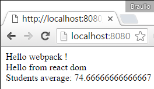

# React

En este ejemplo añadiremos soporte para [React](https://facebook.github.io/react/).

Empezaremos desde el ejemplo
[00 Intro / 03 Ouput](https://github.com/Lemoncode/webpack-1.x-by-sample/tree/master/00%20Intro/03%20Output)
, instalaremos React de forma local, actualizaremos el archivo *students.js* para usar la sintaxis **_jsx_**, instalaremos el plugin
[*babel-preset-react*](https://github.com/babel/babel/tree/master/packages/babel-preset-react)
y lo configuraremos en *webpack.config.js*.


Resumen de los pasos:
 - Instalar React como dependencia local.
 - Añadir un punto de entrada para nuestra aplicacion React en *index.html*.
 - Actualizar *students.js* a *students.__jsx__* y su contenido.
 - Instalar [*babel-preset-react*](https://github.com/babel/babel/tree/master/packages/babel-preset-react)
 asi *babel* podrá resolver los archivos *jsx*.
 - Añadir la configuracion adecuada y necesaria en *webpack.config.js*.


# Pasos para construir

## Prerrequisitos

Necesitarás tener instalado [Node.js](https://nodejs.org) en tu ordenador. Si quieres
seguir esta guía necesitarás tomar como punto de inicio el ejemplo
[00 Intro / 03 Ouput](https://github.com/Lemoncode/webpack-1.x-by-sample/tree/master/00%20Intro/03%20Output).

## pasos

- React es una librería de código abierto para crear *interfaces* (demasiado popular hoy en día), empezaremos instalando la librería (*react* y *react-dom*).


```
npm install react --save
npm install react-dom --save
```

- En el archivo *index.html* vamos a añadir `<div>` que será nuestro punto de inicio para nuestra app React.

```html
<body>
  Hello webpack !
  <div id="root">
  </div>
</body>
```

- Vamos a renombrarlo *students.js* a *students.__jsx__* y actualizamos el código para usar React.

```javascript
import * as React from 'react';
import * as ReactDOM from 'react-dom';
import {getAvg} from './averageService';


const AverageUi = React.createClass({

  getInitialState: function () {
    return { scores: [90, 75, 60, 99, 94, 30], average: 0 };
  },

  componentDidMount: function () {
    this.setState({ average: getAvg(this.state.scores) });
  },

  render: function () {
    return (
      <div>
        <span>Students average: {this.state.average}</span>
      </div>
    );
  }
});

ReactDOM.render(
  <div>
    Hello from react dom
    <AverageUi/>
  </div>
  , document.getElementById('root'));
```

- Para que *babel* parsee los archivos React *jsx* , necesitamos instalar
[*babel-preset-react*](https://github.com/babel/babel/tree/master/packages/babel-preset-react).

```
npm install babel-preset-react --save-dev
```

- Ahora actualizamos *webpack.config.js*, empezaremos añadiendo la extension *jsx* y actualizando el punto de entrada, *students.jsx*.

```
module.exports = {
  entry: ['./students.jsx'],
```

- En las secciones *loaders* necesitamos indicar a *babel-loader* que deberá coger no solo los archivos *js* sino _**jsx**_, y que tiene que tener en cuenta React como *presets*.

```
module: {
  loaders: [
    {
      test: /\.jsx?$/,
      loader: 'babel-loader',
      exclude: /node_modules/,
      query: {
        presets: ['es2015', 'react']
      }
    }
  ]
```

- Finalmente si arrancamos la aplicacion, veremos en acción la correcta funcionalidad  basada en React.


