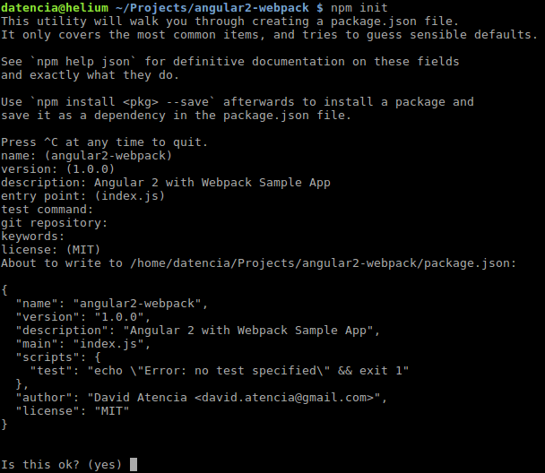
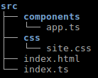
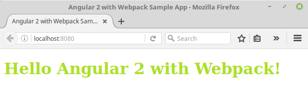

# 03 Angular 2 con Webpack ejemplo de App

En este ejemplo vamos a configurar una app básica de Angular 2 con Webpack.

Pasos a seguir:
- Prerrequisito: Instalar Node.js y npm.
- Crear y configurar el proyecto.
- Configurar webpack.
- Crear la aplicación.
- Construir y ejecutar la aplicación.


## Prerrequisitos

Instalar [Node.js and npm](https://nodejs.org/en/) si no está todavía instalado en tu equipo.

> Verifica que estas ejecutando al menos node v6.x.x y npm 3.x.x ejecutando node -v y npm -v en consola/terminal. Versiones antiguas podrían producir errores.

## Pasos

### Crea y configura el proyecto

- Crea un directorio para ubicar el ejemplo, y haz que sea tu directorio de trabajo.

 ```bash
 $ mkdir angular2-webpack
 $ cd angular2-webpack
 ```

- Ejecuta el comando `npm init`.

 ```bash
 $ npm init
 ```

 Este comando te indica algunas cosas tales como la versión del
 proyecto. Por ahora pulsa RETURN para aceptar por defecto la mayoría de ellas
 (una vez rellenadas se generará un fichero `package.json`).

 

- Ahora instala las dependencias de Angular 2 y guárdalas en la lista de dependencias.

 ```bash
 $ npm install @angular/common @angular/compiler @angular/core
  @angular/platform-browser @angular/platform-browser-dynamic core-js
  reflect-metadata rxjs zone.js --save
 ```

- Instala también las definiciones de typescript para `core-js`.

 ```bash
 $ npm install @types/core-js --save-dev
 ```

 > Esto instalará la mayoría de tipificaciones de Angular 2.

### Configura Webpack

- Instala con `npm` los siguientes paquetes como dependencias de desarrollo:

    - webpack
    - webpack-dev-server

 ```bash
 $ npm install webpack webpack-dev-server --save-dev
 ```

- Ahora instala los siguientes paquetes extra como dependencias de desarrollo:

    - css-loader
    - extract-text-webpack-plugin
    - html-webpack-plugin
    - style-loader
    - ts-loader

 ```bash
 $ npm install html-webpack-plugin extract-text-webpack-plugin
  ts-loader css-loader style-loader --save-dev
 ```

- Modifica el archivo `package.json` y añade la siguiente propiedad `"start": "webpack-dev-server"` debajo de _scripts_. Esto nos permite lanzar webpack desde la línea de comandos de npm escribiendo `npm start`.

- El archivo `package.json` debería parecerse a lo siguiente.

 ```json
  {
    "name": "angular2-webpack-sample-app",
    "version": "1.0.0",
    "description": "Angular 2 with Webpack Sample App",
    "main": "index.js",
    "scripts": {
      "test": "echo \"Error: no test specified\" && exit 1",
      "start": "webpack-dev-server"
    },
    "keywords": [
      "angular2",
      "webpack",
      "sample",
      "app"
    ],
    "author": "David Atencia <david.atencia@gmail.com>",
    "license": "MIT",
    "devDependencies": {
      "@types/core-js": "^0.9.34",
      "css-loader": "^0.25.0",
      "extract-text-webpack-plugin": "^1.0.1",
      "html-webpack-plugin": "^2.22.0",
      "style-loader": "^0.13.1",
      "ts-loader": "^0.8.2",
      "typescript": "^2.0.3",
      "webpack": "^1.13.2",
      "webpack-dev-server": "^1.16.2"
    },
    "dependencies": {
      "@angular/common": "^2.0.2",
      "@angular/compiler": "^2.0.2",
      "@angular/core": "^2.0.2",
      "@angular/platform-browser": "^2.0.2",
      "@angular/platform-browser-dynamic": "^2.0.2",
      "core-js": "^2.4.1",
      "reflect-metadata": "^0.1.8",
      "rxjs": "^5.0.0-beta.12",
      "zone.js": "^0.6.25"
    }
  }
 ```

- Crea un archivo llamado `webpack.config.js` y añade el siguiente contenido.

 ```javascript
  var path = require('path');
  var webpack = require('webpack');
  var HtmlWebpackPlugin = require('html-webpack-plugin');
  var ExtractTextPlugin = require('extract-text-webpack-plugin');
  var basePath = __dirname;

  module.exports = {

    context: path.join(basePath, "src"),

    resolve: {
      extensions: ['', '.js', '.ts']
    },

    entry: {
      app: './index.ts',
      styles: [
        './css/site.css'
      ],
      vendor: [
        "core-js",
        "reflect-metadata",
        "zone.js",
        "@angular/core",
        "@angular/platform-browser",
        "@angular/platform-browser-dynamic",
        "@angular/common",
        "@angular/compiler",
        "rxjs"
      ]
    },

    output: {
      path: path.join(basePath, "dist"),
      filename: '[name].js'
    },

    devServer: {
      contentBase: './dist', //Content base
      inline: true, //Enable watch and live reload
      host: 'localhost',
      port: 8080
    },

    devtool: 'source-map',

    module: {
      loaders: [
        {
          test: /\.ts$/,
          exclude: /node_modules/,
          loader: 'ts'
        },
        {
          test: /\.css$/,
          exclude: /node_modules/,
          loader: ExtractTextPlugin.extract('style', 'css')
        }
      ]
    },

    plugins: [
      new webpack.optimize.CommonsChunkPlugin('vendor', 'vendor.js'),
      new ExtractTextPlugin('[name].css'),
      new HtmlWebpackPlugin({
        filename: 'index.html',
        template: 'index.html'
      })
    ]

  }
 ```

### Crea la aplicación.

- Crea una carpeta llamada `src` con la siguiente estructura. Esta carpeta contendrá la aplicación.

 

- El archivo `app.ts` almacena el componente contenedor principal.

 ```javascript
 import { Component } from '@angular/core';

 @Component(
   {
     selector: 'app',
     template: `
       <h1>{{title}}</h1>
     `
   }
 )
 class App {
   title: string = "Hello Angular 2 with Webpack!"
 }

 export {
   App
 }
 ```

    - **selector**: Esta propiedad se utiliza para definir como llamar estos componentes desde HTML.
    - **template**: Estamos definiendo nuestro *modelo(template)* en una cadena entre [backticks](https://developer.mozilla.org/en-US/docs/Web/JavaScript/Reference/Template_literals) que es una nueva característica de ES6 que permite hacer cadenas multilínea (podríamos también separarlo en un modelo HTML separado).


- El archivo `index.ts` contiene el **NgModule**, que es necesario para arrancar la aplicación.

 ```javascript
 import { NgModule } from '@angular/core';
 import { BrowserModule } from '@angular/platform-browser';
 import { platformBrowserDynamic } from '@angular/platform-browser-dynamic';

 import { App } from './components/app';

 @NgModule({
   declarations: [App],
   imports: [BrowserModule],
   bootstrap: [App]
 })
 class AppModule {
 }

 platformBrowserDynamic().bootstrapModule(AppModule)
 ```

    - **declarations**: define que componentes se van a utilizar en este modulo. En este caso el componente APP.
    - **imports**: describe que  *dependencias* tiene el módulo. En este caso, vamos a crear una aplicación de navegador, así
    que tenemos que usar *BrowserModule*. Vamos a añadir aquí los módulos personalizados que necesita nuestra aplicación.
    - **bootstrap**: esta propiedad le dice a Angular que cargar, en este caso, el componente App como componente raíz.
    - La última línea `platformBrowserDynamic().bootstrapModule(AppModule)` inicializa la plataforma navegador para ejecutar la aplicación AppModule.


- El fichero `index.html` usará el selector `app` que definimos arriba.

 ```html
 <!DOCTYPE html>
 <html>
   <head>
     <meta charset="utf-8">
     <meta name="viewport" content="initial-scale=1, maximum-scale=1">
     <title>Angular 2 with Webpack Sample App</title>
   </head>
   <body>
     <div>
         <app>
           Loading...
         </app>
     </div>
   </body>
 </html>
 ```

- El fichero `site.css` contiene los estilos css utilizados por la aplicación.

 ```css
 h1 {
   color: #ACDF2C
 }
 ```

### Construye y ejecuta la aplicación

- Ejecuta el ejemplo con la siguiente instrucción:

 ```bash
 $ npm start
 ```

 > Esto empaquetará la app e iniciará el servidor de desarrollo.

- Luego, carga http://localhost:8080/ en un navegador para ver la salida.

 
