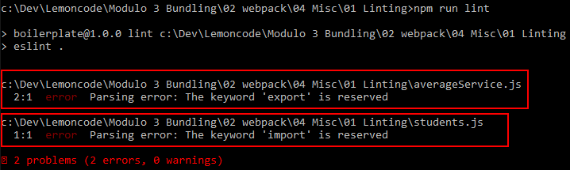
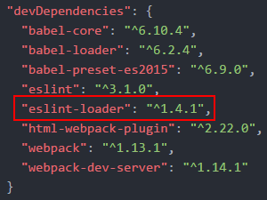
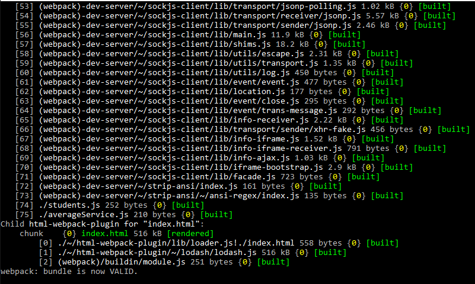
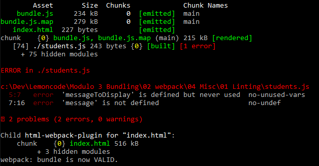
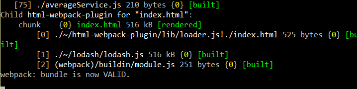

# Modules Sample

In this sample we are going to introduce Linting. This is a technique which you can analyse code for potential errors, so that can help you to make less mistakes.

We will start from sample _00 Intro/03 Output_.

Summary steps:
 - Installing ESLint.
 - Configuring ESLint.
 - Connecting with Babel.
 - Connecting with Webpack.
 - Adding custom rules.

# Steps to build it

## Prerequisites

Prerequisites, you will need to have nodejs installed in your computer. If you want to follow this step guides you will need to take as starting point sample "03 Output"

# Installing and Configuring

- ESLint is the newest tool for linting that goes to the next level and it allows us to using custom rules, parsers, plugings, etc.
Let's start by downloading the eslint library via npm, in this case we will execute the following command from the command prompt "npm install eslint --save-dev"

```
npm install eslint --save-dev
```


- ESLint works with Babel and JSX syntax by installing plugins. That is, It's a great library to develop React projects. This sample is a demo, so come on to implement a basic configuration.
We are going to create a file _.eslintrc.json_ (there are many [file formats options](http://eslint.org/docs/user-guide/configuring#configuration-file-formats))

### .eslintrc.json
```
{
  "extends": [
    "eslint:recommended"
  ],
  "env": {
    "browser": true
  }
}
```

- This is the most basic configuration where we are using [defaults rules](http://eslint.org/docs/rules/) provided by ESLint and we are defining [browser environment](http://eslint.org/docs/user-guide/configuring#specifying-environments) to define browser global variables like _window_ object.

- We can implement a [npm command script](https://docs.npmjs.com/misc/scripts) to run eslint:

### package.json
```
"scripts": {
  "start": "webpack-dev-server --inline",
  "lint": "eslint .",
  "test": "echo \"Error: no test specified\" && exit 1"
}
```

- Executing this command

```
npm run lint
```



- ESLint throws two parse errors due to use _export_ and _import_ keywords. Import and export functionalities are provided by Babel to work with modules. So it's time to connect ESLint with Babel:

```
npm install babel-eslint --save-dev
```

### .eslintrc.json
```
{
  "extends": [
    "eslint:recommended"
  ],
  "env": {
    "browser": true
  },
  "parser": "babel-eslint"
}
```


- As we see, this time `npm run lint` doesn't throw any errors, it sounds good!. But we want to execute ESLint while we are writing our code. That is, the following step is connect ESLint with Webpack.

- We should install _eslint-loader_:

```
npm install eslint-loader --save-dev
```



- To configure Webpack, we're going to use preloader definition. We make sure ESLint parse the code before any other process. We get a _webpack.config.js_ like this:

### webpack.config.js
```
...

module: {
  preLoaders: [
    {
      test: /\.js$/,
      loader: "eslint",
      exclude: /node_modules/,
    }
  ],
  loaders: [
    {
      ....
```

- Now we can remove previous npm command and execute `npm start`.

### package.json
```
...

"scripts": {
  "start": "webpack-dev-server --inline",
  "test": "echo \"Error: no test specified\" && exit 1"
},

...
```



- Naked eye, it looks like nothing happens with the build. Let's go to change the code:

### BEFORE students.js

```
import {getAvg} from "./averageService"

const scores = [90, 75, 60, 99, 94, 30]
const averageScore = getAvg(scores);
const messageToDisplay = `average score ${averageScore}`;

document.write(messageToDisplay);
```


### Typo: using _message_ instead of _messageToDisplay_

```
import {getAvg} from "./averageService"

const scores = [90, 75, 60, 99, 94, 30]
const averageScore = getAvg(scores);
const messageToDisplay = `average score ${averageScore}`;

document.write(message);
```



# Defining Rules

- As we see previously, we are using [ESLint default rules](http://eslint.org/docs/rules/)

### .eslintrc.json
```
{
  "extends": [
    "eslint:recommended"
  ],
...
```

- The good news is that we can [configure all of these rules](http://eslint.org/docs/user-guide/configuring#configuring-rules) following these values:

  - Disable rule: _0_ or _off_
  - Turn to warning: _1_ or _warn_
  - Turn to error: _2_ or _error_

- For example, if we change _students.js_ to this code:

```
import {getAvg} from "./averageService"

const scores = [90, 75, 60, 99, 94, 30]
const averageScore = getAvg(scores);
const messageToDisplay = `average score ${averageScore}`;

console.log(messageToDisplay);
```

- As result, we get this error because the use of _console_ is disallow by default.


- We can disable this rule with the following configuration:

```
{
  "extends": [
    "eslint:recommended"
  ],
  "env": {
    "browser": true
  },
  "parser": "babel-eslint",
  "rules": {
    "no-console": 0
  }
}
```



- Other example is rule named [max-lines](http://eslint.org/docs/rules/max-lines) that it _enforces a maximum number of lines per file, in order to aid in maintainability and reduce complexity._

```
{
  "extends": [
    "eslint:recommended"
  ],
  "env": {
    "browser": true
  },
  "parser": "babel-eslint",
  "rules": {
    "no-console": 0,
    "max-lines": ["error", 1]
  }
}
```

_NOTE:_ We can use "error" or 2. But we can read better this line if we use "error" word.


- To integrate tslinter with React based project we can use [eslint-plugin-react](https://www.npmjs.com/package/eslint-plugin-react) that provides linting for JSX language.
