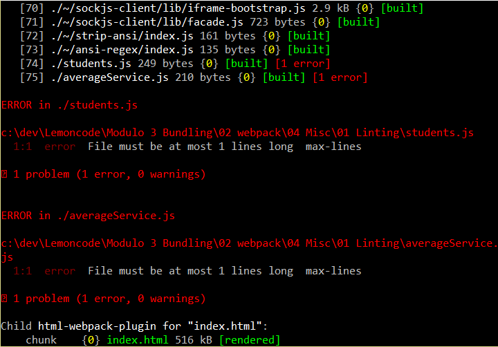

# Ejemplo de módulos

En este ejemplo vamos a introducir el **Linting**. Se trata de una técnica que nos permite analizar el código en busca de errores potenciales, lo que nos puede ayudar a escribir menos errores.

Vamos a empezar a partir del ejemplo _"00 Intro/03 output"_.

Resumen de pasos:
 - Instalación de ESLint.
 - Configuración de ESLint.
 - Conexión con Babel.
 - Conexión con Webpack.
 - Adición de reglas personalizadas.

# Pasos para construirlo

## Prerrequisitos

Necesitarás tener instalado [nodejs](https://nodejs.org/en/) (v. 6.3.1) en tu ordenador. Si quieres seguir esta guía, necesitarás tomar el ejemplo _"00 Intro/03 output"_ como punto de partida.

# Instalación y configuración

- ESLint es la nueva herramienta para linting que va al siguiente nivel y que nos permite el uso de reglas personalizadas, analizadores, plugings, etc.
Vamos a empezar por la descarga de la librería eslint a través de npm, en este caso vamos a ejecutar el siguiente comando desde la línea de comandos "npm install eslint --save-dev"

```
npm install eslint --save-dev
```


- ESLint trabaja con Babel y la sintaxis de JSX mediante la instalación de plugins. Es decir, es una gran librería para desarrollar proyectos React. Este ejemplo es una demo, así que vamos a implementar una configuración básica.
Vamos a crear un archivo _.eslintrc.json_ (hay muchas [opciones de formato de archivo](http://eslint.org/docs/user-guide/configuring#configuration-file-formats))

### .eslintrc.json
```json
{
  "extends": [
    "eslint:recommended"
  ],
  "env": {
    "browser": true
  }
}
```

- Esta es la configuración más básica donde estamos utilizando las [reglas por defecto](http://eslint.org/docs/rules/) proporcionadas por ESLint y estamos definiendo el [entorno del navegador](http://eslint.org/docs/user-guide/configuring#specifying-environments) para definir las variables globales del navegador como el objeto _window_.

- Podemos implementar un [comando de script de npm](https://docs.npmjs.com/misc/scripts) para ejecutar eslint:

### package.json
```json
"scripts": {
  "start": "webpack-dev-server --inline",
  "lint": "eslint .",
  "test": "echo \"Error: no test specified\" && exit 1"
}
```

- Ejecutando este comando:

```
npm run lint
```


- ESLint lanza dos errores de análisis debido al uso de las palabras clave _export_ e _import_. Las funcionalidades import y export son proporcionados por Babel para trabajar con módulos. Así que es hora de conectar ESLint con Babel:

```
npm install babel-eslint --save-dev
```

### .eslintrc.json
```json
{
  "extends": [
    "eslint:recommended"
  ],
  "env": {
    "browser": true
  },
  "parser": "babel-eslint"
}
```


- Como vemos, esta vez `npm run lint` no lanza ningún error, suena bien!. Pero queremos ejecutar ESLint mientras estamos escribiendo nuestro código. Es decir, el siguiente paso es conectar ESLint con Webpack.

- Debemos instalar _eslint-loader_:

```
npm install eslint-loader --save-dev
```


- Para configurar Webpack, vamos a utilizar la definición preloader. Nos aseguramos que ESLint analice el código antes que cualquier otro proceso. Tenemos un _webpack.config.js_ como este:

### webpack.config.js
```
...
module: {
  preLoaders: [
    {
      test: /\.js$/,
      loader: "eslint",
      exclude: /node_modules/,
    }
  ],
  loaders: [
    {
      ...
```

- Ahora podemos eliminar el comando npm anterior y ejecutar `npm start`.

### package.json
```json
...
"scripts": {
  "start": "webpack-dev-server --inline",
  "test": "echo \"Error: no test specified\" && exit 1"
},
...
```


- A simple vista, parece que no pasa nada con el build. Vamos a cambiar el código:

### ANTES students.js

```javascript
import {getAvg} from "./averageService"

const scores = [90, 75, 60, 99, 94, 30]
const averageScore = getAvg(scores);
const messageToDisplay = `average score ${averageScore}`;

document.write(messageToDisplay);
```


### Typo: using _message_ instead of _messageToDisplay_

```javascript
import {getAvg} from "./averageService"

const scores = [90, 75, 60, 99, 94, 30]
const averageScore = getAvg(scores);
const messageToDisplay = `average score ${averageScore}`;

document.write(message);
```


# Definiendo reglas

- Como hemos visto anteriormente, estamos utilizando las [reglas por defecto de ESLint](http://eslint.org/docs/rules/)

### .eslintrc.json

```json
{
  "extends": [
    "eslint:recommended"
  ],
  ...
}
```

- La buena noticia es que podemos [configurar todas estas reglas](http://eslint.org/docs/user-guide/configuring#configuring-rules) siguiendo estos valores:

  - Disable rule: _0_ or _off_
  - Turn to warning: _1_ or _warn_
  - Turn to error: _2_ or _error_

- Por ejemplo, si cambiamos _students.js_ a este código:

```javascript
import {getAvg} from "./averageService"

const scores = [90, 75, 60, 99, 94, 30]
const averageScore = getAvg(scores);
const messageToDisplay = `average score ${averageScore}`;

console.log(messageToDisplay);
```

- Como resultado, obtenemos este error debido a que el uso de _console_ no está permitido de forma predeterminada.


- Podemos desactivar esta regla con la siguiente configuración:

```json
{
  "extends": [
    "eslint:recommended"
  ],
  "env": {
    "browser": true
  },
  "parser": "babel-eslint",
  "rules": {
    "no-console": 0
  }
}
```


- Otro ejemplo es la regla denominada [max-lines](http://eslint.org/docs/rules/max-lines) que _hace cumplir un número máximo de líneas por archivo, con el fin de ayudar en la facilidad de mantenimiento y reducir la complejidad._

```json
{
  "extends": [
    "eslint:recommended"
  ],
  "env": {
    "browser": true
  },
  "parser": "babel-eslint",
  "rules": {
    "no-console": 0,
    "max-lines": ["error", 1]
  }
}
```

_NOTA:_ Podemos utilizar "error" o 2. Pero podemos leer mejor esta línea si usamos la palabra "error".



- Para integrar tslinter con proyectos basados en React podemos utilizar [eslint-plugin-react](https://www.npmjs.com/package/eslint-plugin-react) que proporciona linting para el lenguaje JSX.
